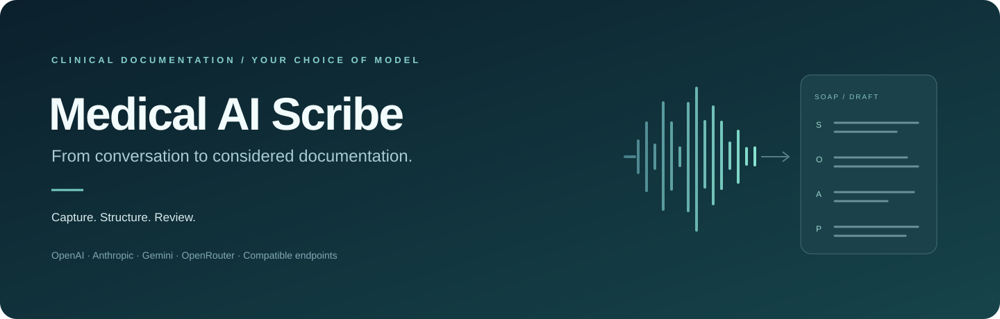
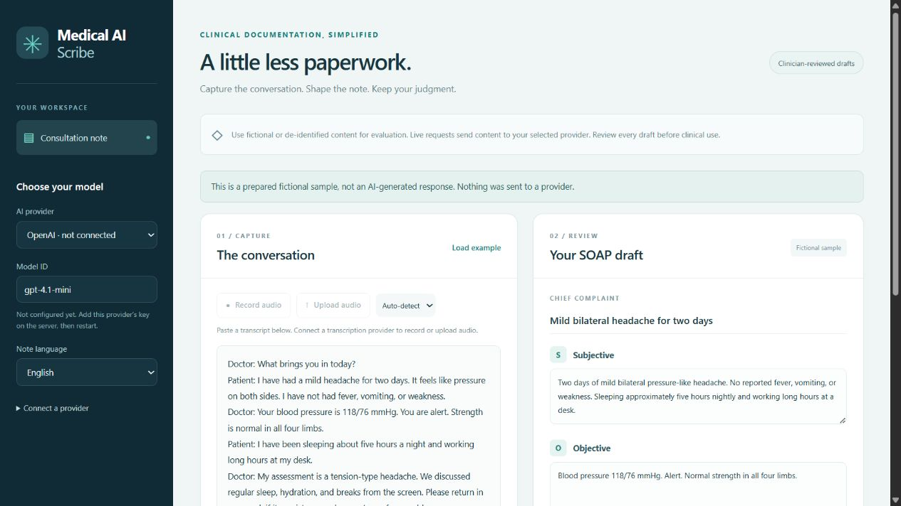
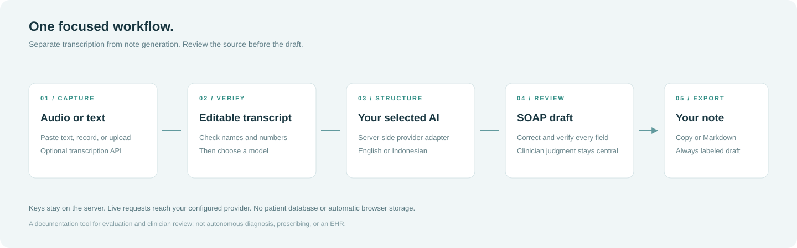

<p align="center"></p>

<p align="center">
  <a href="https://github.com/arthamegayasa/medical-ai-scribe/actions/workflows/checks.yml"></a>
  
  
  
</p>

<p align="center"><a href="#quick-start">Quick start</a> · <a href="#connect-your-models">Model setup</a> · <a href="#the-workflow">Workflow</a> · <a href="#deployment">Deployment</a> · <a href="#development">Development</a></p>

# Medical AI Scribe

**A little less paperwork. A little more room for the patient.**

A focused workspace that turns consultation transcripts into editable **SOAP drafts**. Paste text, or transcribe a short recording, choose a provider and model, and review the note before copying or exporting it. The interface is plain HTML, CSS and JavaScript; the server uses native Node.js APIs.

Originally a BIH presentation demo, this repository is now a standalone Medical AI Scribe. It is independent of a particular hospital and does not imply institutional endorsement.

> The output is a documentation draft, not an autonomous diagnosis or prescription. Start with fictional or de-identified encounters. Clinician review and appropriate data handling are required before any clinical use.

## A look inside



*Actual local application screenshot. The prepared sample is explicitly labeled fictional; no provider request was used to produce this screenshot.*

| Capability | What you get |
| --- | --- |
| **Your choice of model** | OpenAI, Anthropic, Google Gemini, OpenRouter, or a server-configured OpenAI-compatible endpoint. |
| **A simple input flow** | Paste or type a transcript; optionally record or upload a short audio clip. |
| **Separate transcription and drafting** | Correct the raw transcript before sending it to the note-generation model. |
| **English or Bahasa Indonesia** | Choose the output language independently of the source dialogue. |
| **Editable SOAP** | Chief complaint, Subjective, Objective, Assessment and Plan remain editable. |
| **Portable notes** | Copy or download Markdown, with a draft label and source-model information. |
| **A local example** | Explore a prepared fictional encounter without API keys or model charges. |
| **A small codebase** | No frontend build framework, database, or runtime package dependencies. |

## Quick start

Use a maintained **Node.js 22 or 24** release and npm. The supported runtime floor is Node.js 20.

```bash
git clone https://github.com/arthamegayasa/medical-ai-scribe.git
cd medical-ai-scribe
npm ci
npm run dev
```

Open **http://127.0.0.1:3000**. Click **Load example → Preview sample note** to try the complete editing and export flow without connecting an API.

To generate new notes, copy `.env.example` to `.env`, add one provider key, and restart the server:

```bash
cp .env.example .env
npm run dev
```

On PowerShell, the copy command is `Copy-Item .env.example .env`. The local server reads simple `KEY=value` entries from `.env`; already-set process variables take precedence. It does not load `.env.local` or execute shell expressions.

## Connect your models

Provider keys belong in **server environment variables**, never in browser fields. The UI lists configured providers and lets you edit the **Model ID** for each request.

| Provider | Key | Optional default model | API used |
| --- | --- | --- | --- |
| OpenAI | `OPENAI_API_KEY` | `OPENAI_MODEL=gpt-4.1-mini` | Chat Completions |
| Anthropic | `ANTHROPIC_API_KEY` | `ANTHROPIC_MODEL=claude-haiku-4-5-20251001` | Messages |
| Google Gemini | `GEMINI_API_KEY` | `GEMINI_MODEL=gemini-2.5-flash` | Generate Content |
| OpenRouter | `OPENROUTER_API_KEY` | `OPENROUTER_MODEL=openai/gpt-4.1-mini` | Chat Completions |
| OpenAI-compatible | Optional `COMPATIBLE_API_KEY` | Required `COMPATIBLE_MODEL` or a model ID entered in the UI | Chat Completions at `COMPATIBLE_BASE_URL` |

The listed IDs are defaults, not promises that every account can use them. Choose a currently available text model that supports the provider's listed endpoint and can return the required JSON object. Image-only, audio-only, tool-only and endpoint-incompatible models will not work as SOAP generators. Upstream failures are reported as errors; the app never silently substitutes a fictional result.

### Local or self-hosted models

For a local Ollama server exposing its OpenAI-compatible endpoint:

```dotenv
COMPATIBLE_BASE_URL=http://127.0.0.1:11434/v1
COMPATIBLE_MODEL=your-installed-text-model
```

Run the scribe and model server on the same machine, and replace the model value with an installed model. Other compatible services can use a hosted HTTPS endpoint and their own key. The base URL must include the service's API prefix, such as `/v1`. Plain HTTP is accepted only for loopback hosts.

**Local text inference is separate from audio transcription.** A local Ollama text model does not automatically make the audio pipeline local. On a hosted deployment, `127.0.0.1` refers to that server, not your laptop.

### Optional audio transcription

`OPENAI_API_KEY` enables the default OpenAI transcription endpoint, using `whisper-1`. You can independently configure another transcription model or a compatible transcription service:

```dotenv
TRANSCRIPTION_BASE_URL=https://your-transcription-service.example/v1
TRANSCRIPTION_API_KEY=your-server-side-key
TRANSCRIPTION_MODEL=your-transcription-model
```

The endpoint must accept `POST /audio/transcriptions` with multipart audio and return JSON with a `text` field. A custom endpoint uses only its explicitly configured transcription key; it never implicitly receives the OpenAI key. Leave `TRANSCRIPTION_BASE_URL` empty to use OpenAI.

- Supported containers: WebM, MP4/M4A, MP3, WAV, OGG and FLAC, subject to provider support.
- Maximum audio size: **2.5 MB** per request. Browser recording stops after **three minutes**, and a shorter recording may be necessary to stay within the size limit.
- Recording needs microphone permission and HTTPS or localhost. Audio is submitted when recording ends; upload selection submits the selected file.
- Transcription returns editable text. The app does not infer speaker identities or claim true speaker diarization.
- Transcripts are limited to **30,000 characters**. Split longer encounters into suitable segments before use.

## The workflow



1. **Capture** — paste text, record audio, or upload a file.
2. **Verify** — correct the transcript, especially names, medications, numbers and units.
3. **Structure** — choose a provider, model and note language; generate the draft.
4. **Review** — compare every section with the source. Edit the draft before using it.
5. **Export** — copy or save Markdown. If the transcript changed after generation, the exported note includes that warning.

The prompt asks the model to include only explicitly documented facts, assessments and plans, preserve uncertainty, and mark missing information. The server validates the five required fields and rejects malformed, refused or truncated responses. **Schema validation cannot establish clinical correctness**; it checks structure, while the clinician checks meaning.

## Data handling

- The app has no patient database and does not automatically save transcripts, recordings, access tokens or notes to browser storage. Refreshing or clearing the workspace discards its in-memory contents.
- Live audio reaches the configured transcription service. The verified transcript reaches the selected text-model provider. Their retention and processing policies apply; this repository does not establish healthcare compliance or a data-processing agreement.
- Browser copy and export actions create content in the clipboard or a downloaded file. Handle those copies appropriately.
- Provider keys are read only on the server. Upstream errors are redacted, and the application does not log encounter content or credentials. Hosting/network logs are controlled separately by the deployment operator.
- `SCRIBE_ACCESS_TOKEN` protects the costly endpoints on hosted/production runs. This shared workspace token is a small access gate, not a multi-user identity or clinical audit system. Apply appropriate access control, provider spending limits and hosting configuration before shared use.

## Deployment

The repository includes Vercel functions at `/api/config`, `/api/generate-soap`, and `/api/process-audio`. The static build copies only the browser page and its assets into `public/`; server source and environment files are not static-site output.

```bash
npm run check
npm test
npm run build
```

Import this repository into your own Vercel project. `vercel.json` declares the build command and output directory. Set at least one provider key and a strong, random **`SCRIBE_ACCESS_TOKEN`** in the project's server environment. Redeploy after changing environment values. Enter the workspace token in the app's password field; do not enter a provider API key there.

AI endpoints fail closed on Vercel or when `NODE_ENV=production` if the access token is missing. The static example remains usable. A deployment behind a reverse proxy must preserve the request host/origin relationship; cross-origin browser API requests are rejected.

The old repository name, `bih-ai-transcription`, is retained in Git history. Renaming a GitHub repo does not automatically rename an existing hosting project or its domain.

## Development

```text
index.html              Accessible two-panel workspace
assets/                 Browser logic, styling and favicon
api/                    Vercel HTTP entry points
lib/                    Provider adapters, validation, security and build tools
dev-server.js           Local loopback-only Node server
tests/                  Provider and HTTP integration tests
docs/                   Original diagrams and real application screenshot
.env.example            Configuration reference without credentials
vercel.json             Hosted functions and explicit static output
```

| Command | Purpose |
| --- | --- |
| `npm run dev` | Start the local server on `127.0.0.1:3000`. |
| `npm run check` | Check JavaScript syntax, including frontend code. |
| `npm test` | Run mocked provider and HTTP integration tests. |
| `npm run build` | Create the allowlisted static output for hosting. |

Tests cover all five provider request formats, custom model IDs, strict SOAP parsing, authentication, cross-origin rejection, input limits, safe error responses, timeouts, audio multipart encoding and the HTTP transcription-to-note flow. Provider responses are mocked: passing tests confirm the integration protocol, not a paid live API call or clinical validation. Browser checks cover the fictional example, note editing, changed-transcript labeling, copy/export and a mobile layout.

For changes, keep provider-specific behavior in `lib/providers.js`, keep credentials out of frontend code, and add focused tests for meaningful behavior changes. Run the checks before submitting a pull request.

### Provider references

The adapters follow the official [OpenAI Chat API](https://developers.openai.com/api/reference/resources/chat), [Anthropic Messages API](https://platform.claude.com/docs/en/api/messages/create), [Gemini Generate Content API](https://ai.google.dev/api/generate-content), [OpenRouter API](https://openrouter.ai/docs/quickstart), and [OpenAI transcription API](https://developers.openai.com/api/reference/resources/audio/subresources/transcriptions/methods/create). Check each provider for current model availability and usage terms.

---

Created by [Artha Megayasa](https://github.com/arthamegayasa). A license has not yet been selected for this repository.
